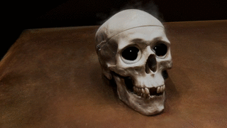
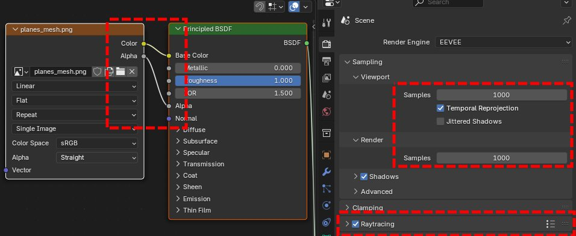

# BillBoard Splatting (BBSplat): Learnable Textured Primitives for Novel View Synthesis

[Project page](https://david-svitov.github.io/BBSplat_project_page/) | [Paper](https://arxiv.org/pdf/2411.08508) | [Video](https://youtu.be/ZnIOZHBJ4wM) | [BBSplat Rasterizer (CUDA)](https://github.com/david-svitov/diff-bbsplat-rasterization/) | [Scenes example (1.5GB)](https://drive.google.com/file/d/1gu_bDFXx38KJtwIrXo8lMVtuY-P2PFXX/view?usp=sharing) |<br>


## Abstract
We present billboard Splatting (BBSplat) - a novel approach for novel view synthesis based on textured geometric primitives. 
BBSplat represents the scene as a set of optimizable textured planar primitives with learnable RGB textures and alpha-maps to 
control their shape. BBSplat primitives can be used in any Gaussian Splatting pipeline as drop-in replacements for Gaussians. 
The proposed primitives close the rendering quality gap between 2D and 3D Gaussian Splatting (GS), enabling the accurate extraction 
of 3D mesh as in the 2DGS framework. Additionally, the explicit nature of planar primitives enables the use of the ray-tracing effects in rasterization.
Our novel regularization term encourages textures to have a sparser structure, enabling an efficient compression that leads to a reduction in the storage 
space of the model up to $\times17$ times compared to 3DGS. Our experiments show the efficiency of BBSplat on standard datasets of real indoor and outdoor 
scenes such as Tanks\&Temples, DTU, and Mip-NeRF-360. Namely, we achieve a state-of-the-art PSNR of 29.72 for DTU at Full HD resolution.

## Updates

* 10/02/2025 - We fixed a bug in the FPS measurement function and updated the preprint accordingly.
* 13/03/2025 - We released the mesh extraction code 

## Repository structure

Here, we briefly describe the key elements of the project. All main python scripts are in the ```./``` directory, 
bash scripts to reproduce the experiments are in the ```scripts``` folder, for a quick start please use 
Docker images provided in the ```docker``` folder.

```bash
.
├── scripts                         # Bash scripts to process datasets
│   ├── colmap_all.sh               # > Extract point clouds with COLMAP
│   ├── dtu_eval.py                 # Script to run DTU Chamfer distance evaluation
│   ├── train_all.sh                # > Fit all scenes
│   ├── render_all.sh               # > Render all scenes
│   └── metrics_all.sh              # > Calculate metrics for all scenes
├── submodules
│   ├── diff-bbsplat-rasterization  # CUDA implementation of BBSplat rasterized
│   └── simple-knn                  # CUDA implementation of KNN
├── docker                          # Scripts to build and run Docker image
├── docker_colmap                   # Scripts to download and run Docker image for COLMAP
├── bbsplat_install.sh              # Build and install submodules
├── convert.py                      # Extract point cloud with COLMAP
├── train.py                        # Train BBSplat scene representation
├── render.py                       # Novel view synthesis 
├── metrics.py                      # Metrics calculation
└── visualize.py                    # Interactive scene visualizer
```


## Installation

We prepared the Docker image for quick and easy installation. Please follow the next steps:

```bash
# Download
git clone https://github.com/david-svitov/BBSplat.git --recursive
# Go to the "docker" subfolder
cd BBSplat/docker

# Build Docker image
bash build.sh
# Optionally adjust mounting folder paths in source.sh
# Run Docker container
bash run.sh

# In the container please install submodules 
bash bbsplat_install.sh
```

<details>
<summary><span style="font-weight: bold;">Docker container for COLMAP</span></summary>

To use COLMAP you can also use provided Docker image in the ```docker_colmap``` as follows:

```bash
cd BBSplat/docker_colmap
# Optionally adjust mounting folder paths in source.sh
# Run Docker container
bash run.sh

# The trick is that you have to install OpenCV in this container because we use "jsantisi/colmap-gpu" one
add-apt-repository universe
apt-get update
apt install python3-pip
python3 -m pip install opencv-python
```
</details>

## Data preprocessing

The example of using ```convert.py``` can be found in ```scripts\colmap.all```. 
Please note that for different datasets in the paper we used different ```images_N``` folders from the COLMAP output folder. 
The instructions on how to install COLMAP can be found above.

We use the same COLMAP loader as 3DGS and 2DGS, you can find detailed description of it [here](https://github.com/graphdeco-inria/gaussian-splatting?tab=readme-ov-file#processing-your-own-scenes). 


## Training
To train a scene, please use following command:
```bash
python train.py -s <path to COLMAP processed dataset> --cap_max=160_000 --max_read_points=150_000 --add_sky_box --eval
```
Commandline arguments description:
```bash
--cap_max # maximum number of Billboards
--max_read_points # maximum number of SfM points for initialization 
--add_sky_box # flag to create additional points for far objects
--eval # to hold each N-th image for evaluation

# 2DGS normal-depth regularization can be beneficial for some datasets
--lambda_normal  # hyperparameter for normal consistency
--lambda_distortion # hyperparameter for depth distortion
```

The examples of training commands for different datasets can be found in ```scripts\train_all.sh```.

## Testing
### Novel view synthesis evaluation
For novel view synthesis use:
```bash
python render.py -m <path to pre-trained model> -s <path to COLMAP dataset> 
```

Commandline arguments description:
```bash
--skip_mesh # flag to disable mesh extraction to accelerate NVS evaluation
--save_planes # flag to save BBSplat as a set of textured planes
```

To calculate metrics values use:
```bash
python metrics.py -m <path to pre-trained model>
```
The examples for the datasets used in the paper can be found in ```scripts\render_all.sh``` and ```scripts\metrics_all.sh```.

---
❗ **Faster inference**

There is an option to accelerate inference speed by using more tight bounding boxes in the rasterisation. To do this follow next steps:
* Open ```submodules/diff-bbsplat-rasterization/cuda_rasterizer/auxiliary.h```
* Modify ```#define FAST_INFERENCE 0``` to be ```#define FAST_INFERENCE 1```
* Rebuild the code with ```.\bbsplat_install.sh```

This will give you up to $\times 2$ acceleration by the cost of slight metrics degradation.

---

### DTU Chamfer distance evaluation

To calculate Chamfer distance metrics for the DTU dataset simple run ```scripts\dtu_eval.py``` as fallows:
```bash
python scripts/dtu_eval.py --dtu=<path to the preprocessed DTU dataset> --output_path=<path to save training results> --DTU_Official=<path to the official DTU dataset>
```

## Exporting to Blender

The newest feature of the code is convertion of BBSplat into set of textured planes for rasterization in Blender:

<p float="left">


</p>

To do this follow these instructions. First you have to enable StopThePop sorting of billboards:
* Open ```submodules/diff-bbsplat-rasterization/cuda_rasterizer/auxiliary.h```
* Switch ```#define TILE_SORTING 0``` to ```#define TILE_SORTING 1```
* Switch ```#define PIXEL_RESORTING 0``` to ```#define TILE_SORTING 1```
* Make sure that ```#define FAST_INFERENCE 0``` is seit to 0
* Rebuild the code with ```.\bbsplat_install.sh```

Next simple run ```render.py``` with ```--save_planes``` flag. In the folder you will find ```planes_mesh.obj```. Import it to the blender.

As the final step use alpha textures for alpha channel in Blender shader settings. Enable Raytracing and adjust sampling number for EEVEE renderer:


## Interactive visualization


To dynamically control camera position use ```visualize.py``` with the same ```-m -s``` parameters as ```render.py```

## Citation
If you find our code or paper helps, please consider citing:
```bibtex
@article{svitov2024billboard,
  title={BillBoard Splatting (BBSplat): Learnable Textured Primitives for Novel View Synthesis},
  author={Svitov, David and Morerio, Pietro and Agapito, Lourdes and Del Bue, Alessio},
  journal={arXiv preprint arXiv:2411.08508},
  year={2024}
}
```