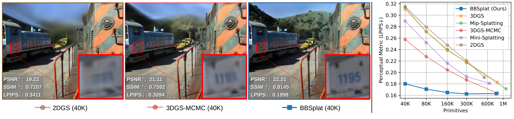
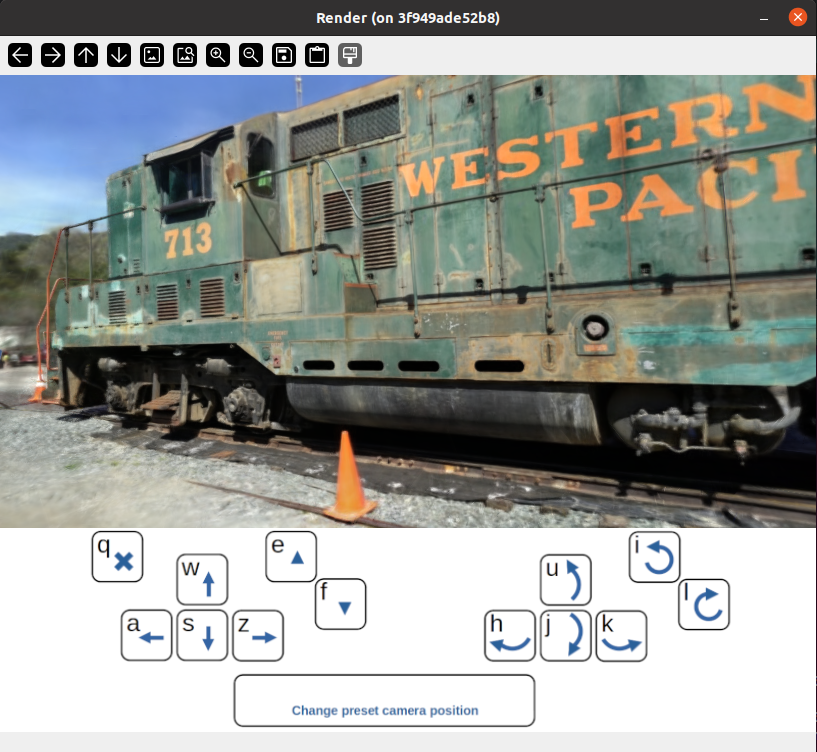

# BillBoard Splatting (BBSplat): Learnable Textured Primitives for Novel View Synthesis

[Project page](https://david-svitov.github.io/BBSplat_project_page/) | [Paper](https://arxiv.org/pdf/2411.08508) | [Video](https://www.youtube.com/watch?v=uRM7WFo5vVg) | [BBSplat Rasterizer (CUDA)](https://github.com/david-svitov/diff-bbsplat-rasterization/) | [Scenes example (1.5GB)](https://drive.google.com/file/d/1gu_bDFXx38KJtwIrXo8lMVtuY-P2PFXX/view?usp=sharing) |<br>



## Abstract
We present billboard Splatting (BBSplat) - a novel approach for 3D scene representation based on textured geometric primitives. 
BBSplat represents the scene as a set of optimizable textured planar primitives with learnable RGB textures and alpha-maps to control 
their shape. BBSplat primitives can be used in any Gaussian Splatting pipeline as drop-in replacements for Gaussians. Our method's 
qualitative and quantitative improvements over 3D and 2D Gaussians are most noticeable when fewer primitives are used, 
when BBSplat achieves over 1200 FPS. Our novel regularization term encourages textures to have a sparser structure, 
unlocking an efficient compression that leads to a reduction in storage space of the model. Our experiments show the efficiency 
of BBSplat on standard datasets of real indoor and outdoor scenes such as Tanks&Temples, DTU, and Mip-NeRF-360. We demonstrate 
improvements on PSNR, SSIM, and LPIPS metrics compared to the state-of-the-art, especially for the case when fewer primitives
are used, which, on the other hand, leads to up to $2 \times$ inference speed improvement for the same rendering quality.

## Repository structure

Here, we briefly describe the key elements of the project. All main python scripts are in the ```./``` directory, 
bash scripts to reproduce the experiments are in the ```scripts``` folder, for a quick start please use 
Docker images provided in the ```docker``` folder.

```bash
.
├── scripts                         # Bash scripts to process datasets
│   ├── colmap_all.sh               # > Extract point clouds with COLMAP
│   ├── train_all.sh                # > Fit all scenes
│   ├── render_all.sh               # > Render all scenes
│   └── metrics_all.sh              # > Calculate metrics for all scenes
├── submodules
│   ├── diff-bbsplat-rasterization  # CUDA implementation of BBSplat rasterized
│   └── simple-knn                  # CUDA implementation of KNN
├── docker                          # Scripts to build and run Docker image
├── docker_colmap                   # Scripts to download and run Docker image for COLMAP
├── bbsplat_install.sh             # Build and install submodules
├── convert.py                      # Extract point cloud with COLMAP
├── train.py                        # Train BBSplat scene representation
├── render.py                       # Novel view synthesis 
├── metrics.py                      # Metrics calculation
└── visualize.py                    # Interactive scene visualizer
```


## Installation

We prepared the Docker image for quick and easy installation. Please follow the next steps:

```bash
# Download
git clone https://github.com/david-svitov/BBSplat.git --recursive
# Go to the "docker" subfolder
cd BBSplat/docker

# Build Docker image
bash build.sh
# Optionally adjust mounting folder paths in source.sh
# Run Docker container
bash run.sh

# In the container please install submodules 
bash bbsplat_install.sh
```

<details>
<summary><span style="font-weight: bold;">Docker container for COLMAP</span></summary>

To use COLMAP you can also use provided Docker image in the ```docker_colmap``` as follows:

```bash
cd BBSplat/docker_colmap
# Optionally adjust mounting folder paths in source.sh
# Run Docker container
bash run.sh

# The trick is that you have to install OpenCV in this container because we use "jsantisi/colmap-gpu" one
add-apt-repository universe
apt-get update
apt install python3-pip
python3 -m pip install opencv-python
```
</details>

## Data preprocessing

Please note that we modified ```convert.py``` compared to 3DGS to first downsample images to 800 pixels on the large side.
The example of using ```convert.py``` can be found in ```scripts\colmap.all```. Please pay attention to use ```--resize``` 
flag for preprocessing datasets. The instructions on how to install COLMAP can be found above.

We use the same COLMAP loader as 3DGS and 2DGS, you can find detailed description of it [here](https://github.com/graphdeco-inria/gaussian-splatting?tab=readme-ov-file#processing-your-own-scenes). 


## Training
To train a scene, please use following command:
```bash
python train.py -s <path to COLMAP processed dataset> --cap_max=160_000 --max_read_points=150_000 --add_sky_box
```
Commandline arguments description:
```bash
--cap_max # maximum number of Billboards
--max_read_points # maximum number of SfM points for initialization 
--add_sky_box # flag to create additional points for far objects

# 2DGS normal-depth regularization can be beneficial for some datasets
--lambda_normal  # hyperparameter for normal consistency
--lambda_distortion # hyperparameter for depth distortion
```

The examples of training commands for different datasets can be found in ```scripts\train_all.sh```.

## Testing
For novel view synthesis use:
```bash
python render.py -m <path to pre-trained model> -s <path to COLMAP dataset> 
```

To calculate metrics values use:
```bash
python metrics.py -m <path to pre-trained model>
```

The examples for the datasets used in the paper can be found in ```scripts\render_all.sh``` and ```scripts\metrics_all.sh```.

## Interactive visualization



To dynamically control camera position use ```visualize.py``` with the same parameters as ```render.py```

## Citation
If you find our code or paper helps, please consider citing:
```bibtex
@article{svitov2024billboard,
  title={BillBoard Splatting (BBSplat): Learnable Textured Primitives for Novel View Synthesis},
  author={Svitov, David and Morerio, Pietro and Agapito, Lourdes and Del Bue, Alessio},
  journal={arXiv preprint arXiv:2411.08508},
  year={2024}
}
```
